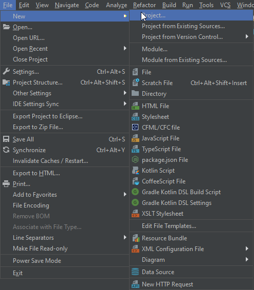
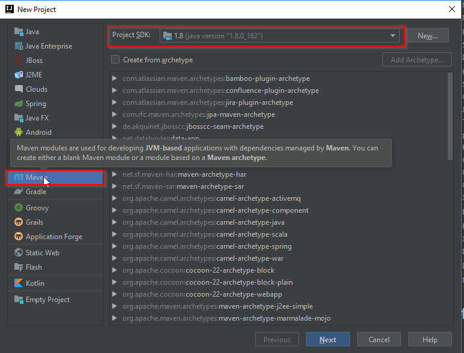

# Spring Boot application with Azure SDK

## Requirements
+ JDK 8
+ Spring Boot 2.1.6.RELEASE
+ Azure SDK
  - Identity 1.0.0-preview.1
  - KeyVault Keys 4.0.0-preview.1

We will use IntelliJ for demonstrating how to create a simple RESTful service using spring boot and Maven.

## Create a new project 

 

## Maven and JDK 


## Group and artifact
Provide maven group and artifact id to complete the project creation process.

## Project structure 
After creating the project, you should see the following directory structure


## Dependencies
To configure dependencies, open `pom.xml` file. It should look similar to the one below
```
<?xml version="1.0" encoding="UTF-8"?>
<project xmlns="http://maven.apache.org/POM/4.0.0"
  xmlns:xsi="http://www.w3.org/2001/XMLSchema-instance"
  xsi:schemaLocation="http://maven.apache.org/POM/4.0.0 http://maven.apache.org/xsd/maven-4.0.0.xsd">
  <modelVersion>4.0.0</modelVersion>

  <groupId>org.azuredemo</groupId>
  <artifactId>azuredemo</artifactId>
  <version>1.0-SNAPSHOT</version>
</project>
```

Now, we need to add the following dependencies
+ Spring Boot web starter
+ Azure SDK
   - Identity
   - KeyVault Keys

Add the following xml snippet after the line `<version>1.0-SNAPSHOT</version>` in your `pom.xml`

```
<dependencies>
    <!-- Spring Boot web starter -->
    <dependency>
      <groupId>org.springframework.boot</groupId>
      <artifactId>spring-boot-starter-web</artifactId>
    </dependency>

    <!-- Azure Identity -->
    <dependency>
      <groupId>com.azure</groupId>
      <artifactId>azure-identity</artifactId>
      <version>1.0.0-preview.1</version>
    </dependency>

    <!-- Azure KeyVault - Keys -->
    <dependency>
      <groupId>com.azure</groupId>
      <artifactId>azure-keyvault-keys</artifactId>
      <version>4.0.0-preview.1</version>
    </dependency>
  </dependencies>
```
After adding this, maven will download the necessary jars from [Maven repository](https://mvnrepository.com/repos/central)

